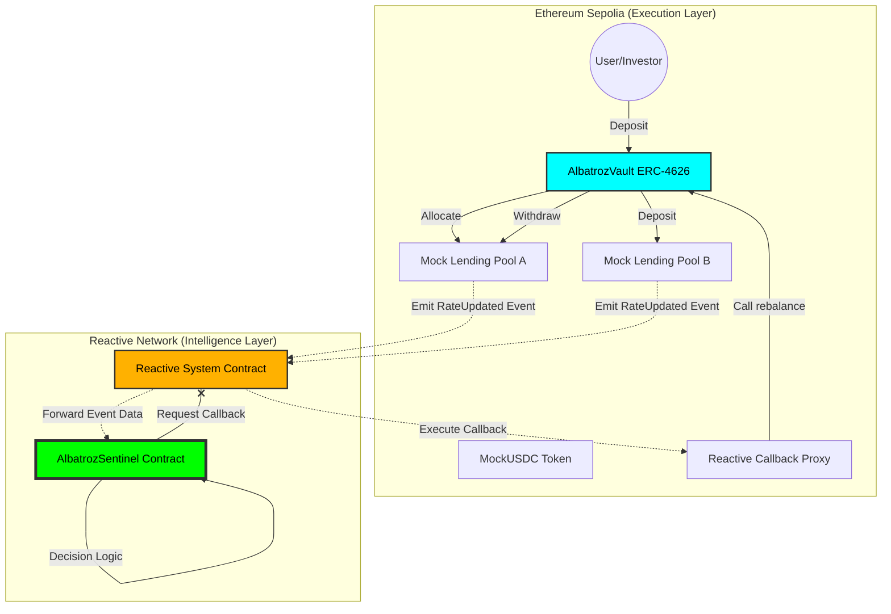
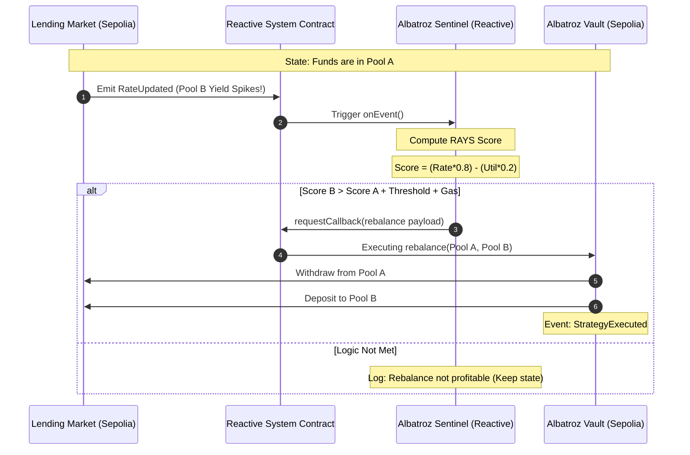

Berikut adalah visualisasi **Architecture System** dan **Logic Flow** menggunakan Mermaid untuk proyek Albatroz Sentinel. Diagram ini akan sangat membantu juri memahami bagaimana "otak" Reactive Network berkomunikasi dengan "otot" di Sepolia.

### 1. System Architecture Diagram
Diagram ini menunjukkan struktur komponen di dua jaringan yang berbeda dan bagaimana data mengalir di antara keduanya.

---

### 2. Sequence Diagram: Autonomous Rebalancing Flow
Diagram ini menjelaskan urutan kejadian (step-by-step) mulai dari perubahan bunga di pasar hingga eksekusi dana.

---

### 3. Penjelasan Arsitektur (Untuk Dokumentasi README)

**A. Execution Layer (Sepolia):**
*   **AlbatrozVault:** Bertindak sebagai *Gateway* tunggal bagi pengguna. Menggunakan standar ERC-4626 untuk kompatibilitas DeFi yang luas.
*   **Mock Lending Pools:** Sumber kebenaran (*Source of Truth*) data pasar. Setiap perubahan bunga memicu gelombang informasi ke jaringan reaktif.
*   **Callback Proxy:** Gerbang keamanan yang memastikan hanya instruksi valid dari Reactive Network yang bisa menggerakkan dana.

**B. Intelligence Layer (Reactive Network):**
*   **Subscription Model:** Sentinel tidak melakukan *polling* (yang memboroskan gas), melainkan berlangganan secara pasif. Ia hanya aktif ketika ada perubahan data yang relevan.
*   **Weighted Decision Engine:** Menggunakan rumus finansial (RAYS) untuk mengevaluasi apakah sebuah perpindahan dana menguntungkan setelah dikurangi biaya transaksi dan risiko likuiditas.
*   **Cross-Chain Orchestrator:** Sentinel bertindak sebagai konduktor orkestra, mengarahkan aset di Sepolia berdasarkan intelijen yang diproses secara otonom di Lasna.

---

### 4. Logic Summary (The "Brain" Logic)

| Tahap | Aktivitas | Rumus / Logika |
| :--- | :--- | :--- |
| **Ingestion** | Mendengar event `RateUpdated` | `abi.decode(data, (rate, util))` |
| **Analysis** | Menghitung Skor Risiko | `(Rate * 0.8) - (Util * 0.2)` |
| **Arbitrage** | Cek Keuntungan Netto | `DeltaScore > Threshold + GasCost` |
| **Safety** | Proteksi Aset | `minAmountOut = amount * 0.99` |
| **Action** | Callback Eksekusi | `rebalance(from, to, amount, minOut)` |

---

### Kesimpulan Final Verdict untuk README:
> "Arsitektur ini memisahkan **Kepemilikan Aset** (di Sepolia) dan **Logika Strategi** (di Reactive Network). Hasilnya adalah sistem yang memiliki keamanan setingkat *cold-storage* namun memiliki kelincahan setingkat *high-frequency trading bot*. Inilah manifestasi sejati dari **Smart Liquidity**."

Dengan diagram Mermaid ini, dokumentasi kamu akan terlihat sangat profesional dan memudahkan juri untuk memberikan nilai penuh pada aspek **Technical Design**. 🚀