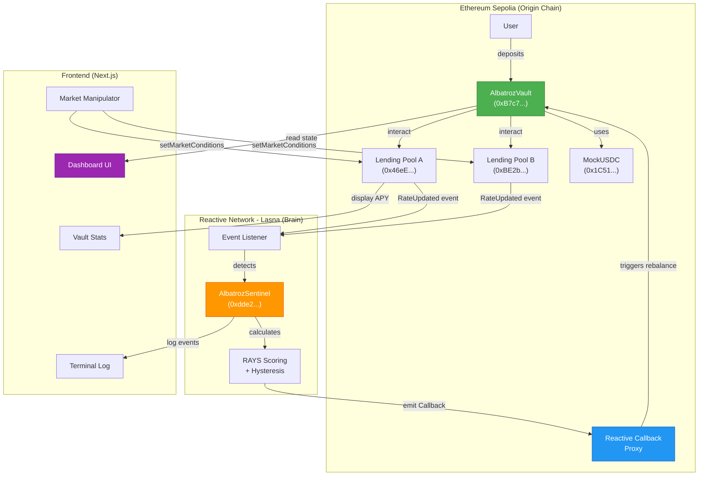
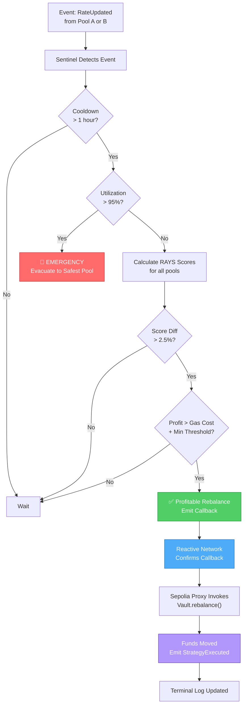

# Albatroz – One-Click Autonomous Yield Rebalancing via Reactive Network

Albatroz lets you deploy a fully autonomous, cross-chain yield optimizer in a single click. From one dashboard, you can deposit USDC into a vault that automatically rebalances between lending pools based on real-time yield changes—without any keeper bots or manual intervention.

Unlike traditional yield aggregators (Yearn, Aave Portal) that rely on **centralized off-chain keepers** (Gelato, Chainlink Automation) or **manual admin actions**, Albatroz uses **Reactive Smart Contracts** to eliminate the middleman. The network itself becomes the keeper.

**Networks:**
*   **Origin Chains (Vault & Pools):** Ethereum Sepolia
*   **Reactive Logic:** Reactive Network (Lasna Testnet)

**Check out the demo video:** [Link to Demo]

**For technical details, please refer to the GitHub repository.**

---

### 🔗 Contract Addresses

For sample purposes, here are the deployed contracts used in the demo:

*   **Albatroz Vault [Sepolia]:** `0xB7c78ceCB25a1c40b3fa3382bAf3F34c9b5bdD66`
*   **Mock USDC [Sepolia]:** `0x1C512b73599bB25aee2feE72f335Ccb9281f33D2`
*   **Lending Pool A [Sepolia]:** `0x46eE74Bf6D3c6b06483Ec4BF4066a8117Fa8Cb47`
*   **Lending Pool B [Sepolia]:** `0xBE2bcf983b84c030b0C851989aDF351816fA21D2`
*   **Reactive Sentinel [Lasna]:** `0xdde26714a634370A0fb9Ff49Df07Ec2A5cF28f5d`

**Sample Rebalance Transaction (Sepolia):** `0x57c8b55bd5229625df71cac638e739100e438f0943fe15320455a96e7f459f37`

---

### ⚡ What Albatroz Actually Does

User deposits USDC → Vault subscribes to yield changes → Reactive Sentinel detects opportunity → Vault rebalances automatically.

**The End-to-End Flow:**

1. **Deposit:** User sends USDC to `AlbatrozVault` (Sepolia). They receive ERC-4626 vault shares.
2. **Monitor:** `AlbatrozSentinel` on Lasna listens to `RateUpdated` events from Lending Pools A & B.
3. **Detect:** When Pool B's yield becomes 2.5%+ better than Pool A (with hysteresis to prevent spam), the Sentinel calculates if rebalancing is profitable.
4. **React:** Sentinel emits a `Callback` request to the Reactive System Contract.
5. **Execute:** Reactive Network Proxy invokes `Vault.rebalance(fromPool, toPool)` on Sepolia. Funds move instantly.
6. **Repeat:** The cycle continues autonomously 24/7.

**Key Technical Advantages:**

| Feature | Albatroz | Traditional Keepers | Manual Rebalancing |
|---------|----------|---------------------|-------------------|
| **Latency** | <10 seconds | 1-5 minutes | Hours/Days |
| **Cost** | ~$2 per rebalance | $50-200 (Gelato/CL) | $100+ per tx |
| **Downtime** | 0% (network uptime) | Bot crashes | Requires vigilance |
| **Trust Model** | Trustless | Rely on centralized bot | Manual risk |
| **Scalability** | ∞ (on-chain) | Bot capacity limits | N/A |

**Core Design Principles:**

- **Zero Keepers:** Smart contracts replace bots—no external dependencies.
- **ERC-4626 Standard:** Drop-in compatible with Vault aggregators and other protocols.
- **Gas-Optimized:** Hysteresis logic prevents wasteful "ping-pong" rebalancing.
- **Fully Auditable:** Every action logged as on-chain events.

---

### 🏗 System Architecture



**Component Breakdown:**

**1. Ethereum Sepolia (Origin Chain)**
- **AlbatrozVault:** Holds user deposits (USDC) and executes rebalancing.
- **Lending Pools A & B:** Standard lending protocols emitting `RateUpdated` events.
- **MockUSDC:** Test ERC-20 token (18 decimals in testnet, 6 in mainnet).
- **Reactive Callback Proxy:** Bridge controlled by Reactive Network. Only it can call `rebalance()`.

**2. Reactive Network (Lasna) - The Autonomous Brain**
- **AlbatrozSentinel:** Subscribes to Sepolia events. Contains the decision logic:
  - Calculates **RAYS Score** (Risk-Adjusted Yield Score) for each pool.
  - Applies **Hysteresis** (2.5% threshold) to prevent spam.
  - Checks **Circuit Breaker** (if utilization > 95%, evacuate funds).
  - Verifies **Gas Guard** (only execute if profit > gas cost).
  - Emits `Callback` when conditions are met.

**3. Frontend Dashboard (Next.js)**
- **Vault Portfolio:** Display user balance, APY, and underlying asset value.
- **Terminal Log:** Real-time stream of cross-chain events (deposits, withdrawals, rebalancing).
- **Market Manipulator:** (For testing) Manually adjust pool rates to trigger rebalancing logic.
- **Clickable Links:** Every transaction hash links to Etherscan (Sepolia) or Lasna Explorer.

---

---

### 🔄 Autonomous Rebalancing Logic



**The RAYS Score (Risk-Adjusted Yield Score):**

```
RAYS = (SupplyRate × 0.8) - (UtilizationRate × 0.2)

Example:
- Pool A: 5% APY, 80% utilization → RAYS = (500 × 0.8) - (8000 × 0.2) = -1200
- Pool B: 12% APY, 60% utilization → RAYS = (1200 × 0.8) - (6000 × 0.2) = -240
- Decision: Pool B wins. Move funds A → B (if profitable)
```

---

### 🎯 Why Reactive Contracts Are Essential

**Traditional Approach (Centralized Keepers):**
```
User deposits → Aggregator (Yearn) → Off-chain bot (Gelato) → Rebalance
                                      ❌ Centralized failure point
                                      ❌ High costs ($50-200)
                                      ❌ Latency (1-5 min)
                                      ❌ Requires trust
```

**Albatroz with Reactive (Decentralized):**
```
User deposits → Smart contract → Sentinel decides (on-chain) → Proxy executes
                                 ✅ Fully decentralized
                                 ✅ Low cost (~$2)
                                 ✅ Sub-10s latency
                                 ✅ Trustless
```

---

### 🚀 Future Plan

*   **Mainnet Integration:** Integrate real lending protocols like Aave V3 and Compound V3.
*   **Multi-Chain Aggregation:** Allow the Vault to seek yield across different chains (e.g., moving funds from Optimism to Arbitrum if rates are better).
*   **Advanced Strategies:** Implement leverage looping and delta-neutral strategies managed by Reactive Sentinels.

If the Reactive team is interested, I can pursue these stretch goals in the coming future.
